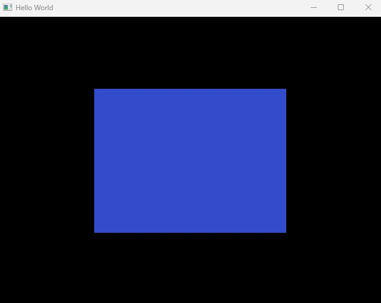
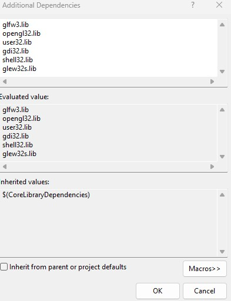

# Getting Started with OpenGL

Documenting my process for getting up and running with OpenGL.  Thanks to [TheCherno](https://www.youtube.com/@TheCherno) for providing a lot of in-depth resources on this topic.



## Setup

To get up and running, I needed to install [GLFW](https://www.glfw.org/download.html) and [GLEW](https://glew.sourceforge.net/). 


#Setting up GLFW and GLEW pre-compiled binaries

1.  Create a dependencies folder in solution root folder
2.  Add separate folders for GLFW and GLEW
3.  Nest a Libaries and Includes Folder in both 
4.  Add the appropriate include folders from each (containing an .h file) into the include folders
5.  Add the version specific libraries from each into the libraries folders

Now that the dependencies are in the project directory, Visual Studio has to be told to use them in the OpenGL project.

#Linking Includes and Libraries to VS project

1. From the context menu, go to Project -> Properties
2. Ensure Configuration is set to All Configurations and Platform is set to the platform you are building for (not your own platform)
3. Unfold C/C++ and go to the General tab.  Under Additional Include Directories, click into the window and open the context menu to add the include folders for each
4. Next, go to the Linker tab on the left side of the property page, and open up the General tab. 
5. Under the Additional Library Directories, repeat the process and add the folders that contain the .lib files for GLFW and GLEW
6. Still under the Linker tab on the left of the project properties page, go to Input
7. Under Additional Dependencies, add the glfw3.lib;opengl32.lib;glew32s.lib to the list of core dependencies. 

_Your final Additional Dependencies evaluated values should look like this_



You can make sure everything is running properly by first going to the [GLFW Documentation Page](https://www.glfw.org/documentation.html) and adding the Example Code to the project.

```
#include <GLFW/glfw3.h>

int main(void)
{
    GLFWwindow* window;

    /* Initialize the library */
    if (!glfwInit())
        return -1;

    /* Create a windowed mode window and its OpenGL context */
    window = glfwCreateWindow(640, 480, "Hello World", NULL, NULL);
    if (!window)
    {
        glfwTerminate();
        return -1;
    }

    /* Make the window's context current */
    glfwMakeContextCurrent(window);

    /* Loop until the user closes the window */
    while (!glfwWindowShouldClose(window))
    {
        /* Render here */
        glClear(GL_COLOR_BUFFER_BIT);

        /* Swap front and back buffers */
        glfwSwapBuffers(window);

        /* Poll for and process events */
        glfwPollEvents();
    }

    glfwTerminate();
    return 0;
}
```

#Configuring GLEW

GLEW is shorthand for the OpenGL Extension Wrangler Library.

It's an open source C/C++ extension loading library that provides efficient run-time mechanisms for determing which OpenGL extensions are supported on the project's target platform.

Pop a quick 
```
#include <GL/GLEW.h>
```
into you cpp file to make sure the includes have been properly configured.

If there are issues with the linking, check back in the includes and library directories added earlier and click the window's context menu and paste the evaluated values path into your window to make sure it's linking to the correct location of the files.  For this project, I included these dependencies in the root solution folder for the actual project.

GLEW's usage documentation specifies that the 
```
glewInit()
```
function must be called to initialize the extension entry points.  It needs to be created after the OpenGL rendering context.  In the case of the example code provided by GLFW, the glewInit() function needs to be called after the glfwMakeContextCurrent(window) line.

```    
/* Make the window's context current */
    glfwMakeContextCurrent(window);

    if (glewInit() != GLEW_OK)
        std::cout << "Error" << std::endl;


    std::cout << glGetString(GL_VERSION) << std::endl;

```


