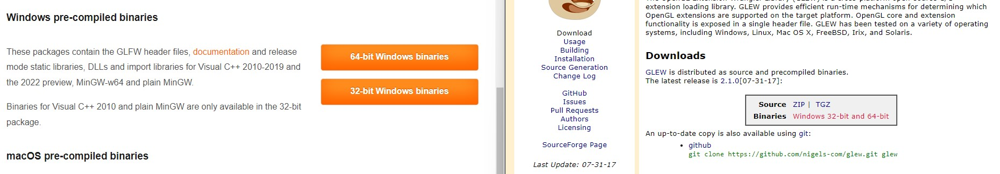

# Getting Started with OpenGL

Documenting my process for getting up and running with OpenGL.

## Setup

To get up and running, I needed to install [GLFW](https://www.glfw.org/download.html) and [GLEW](https://glew.sourceforge.net/). 

#Setting up GLFW and GLEW pre-compiled binaries

1.  Create a dependencies folder in solution root folder
2.  Add separate folders for GLFW and GLEW
3.  Nest a Libaries and Includes Folder in both 
4.  Add the appropriate include folders from each (containing an .h file) into the include folders
5.  Add the version specific libraries from each into the libraries folders

Now that the dependencies are in the project directory, Visual Studio has to be told to use them in the OpenGL project.

#Linking Includes and Libraries to VS project

1. From the context menu, go to Project -> Properties
2. Ensure Configuration is set to All Configurations and Platform is set to the platform you are building for (not your own platform)
3. Unfold C/C++ and go to the General tab.  Under Additional Include Directories, click into the window and open the context menu to add the include folders for each
4. Next, go to the Linker tab on the left side of the property page, and open up the General tab. 
5. Under the Additional Library Directories, repeat the process and add the folders that contain the .lib files for GLFW and GLEW
6. Still under the Linker tab on the left of the project properties page, go to Input
7. Under Additional Dependencies, add the glfw3.lib;opengl32.lib;glew32s.lib to the list of core dependencies. 

